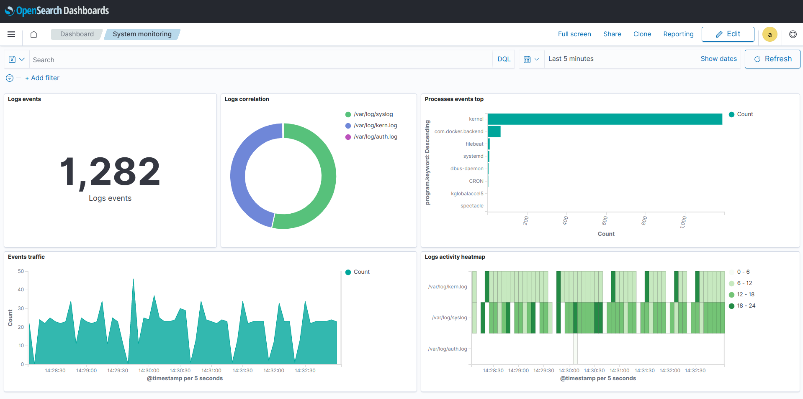

# VBTestTasks

## Opensearch

Статусы:

✅ - Выполнено

⏳ - В процессе

❌ - Пропущено

| Задача | Статус |
| ------ | :----: |
| Почитать про opensearch/elasticsearch, logstash, агенты elatic beats. Понять что это и зачем. | ✅ |
| Установить Opensearch, Opensearch-dashboards (Версия 2.5 или старше) на *nix. | ✅ |
| Установить logstash (OSS, 8.5 и старше) и filebeat (версии OSS) | ✅ |
| Ознакомиться с принципами нормализации и модели данных ECS (Elastic Common Scheme). | ⏳ |
| Настроить сбор данных по цепочкам (файл → filebeat → logstash → opensearch) и (файл → logstash → opensearch). | ✅ |
| Построить дашборд/ы на основе собираемых данных (что вынести на дашборд, на ваше усмотрение) | ✅ |

Полученный дэшборд:

## Ansible
| Задача | Статус |
| ------ | :----: |
| Ansible - посмотреть, попробовать сконфигурировать с его помощью добавление пользователя и добавление его в sudo. | ✅ |
| После этого развернуть Ansible Semaphore и сделать тоже самое с его помощью. | ⏳ |